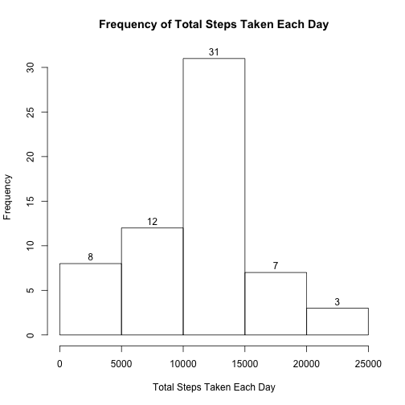
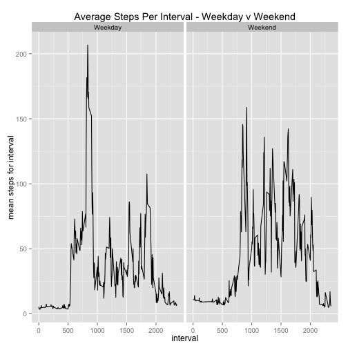

## Loading and preprocessing the data

Because we need to be in our working directory to knit the Rmd file, we're already in the directory that has the data - therefore just load data and change the class of the date field from "factor" to "Date": 

```r
Data <- read.csv("activity.csv")
Data$date <- as.Date(Data$date)
```

## Set Global Options
Always show both code and results

```r
opts_chunk$set(echo=T, results="asis")
```

## What is mean total number of steps taken per day?
Calculate total # of steps for each day and make a histogram

```r
library(dplyr)
```

```
## 
## Attaching package: 'dplyr'
## 
## The following object is masked from 'package:stats':
## 
##     filter
## 
## The following objects are masked from 'package:base':
## 
##     intersect, setdiff, setequal, union
```

```r
daily_total <- group_by(Data, date)
daily_total <- summarize(daily_total, total_steps=sum(steps, na.rm=T))
total_steps_hist <- hist(daily_total$total_steps, xlab="Total Steps Taken Each Day", main="Frequency of Total Steps Taken Each Day", labels=T)
```

 

Looks like most frequently (28 out of the 61 days, aka ~46% of the time), this person took between 10,000 and 15,000 steps per day.

Let us calculate mean/median number of steps taken per day. We will get an NA or NaN as result for days during which no steps were taken - will exclude those days from the daily table. We will first show the overall daily mean and median, and then will show a seperate table that shows the mean and median for each specific day in the set. I borrowed the useful tableCat function for tranforming a dataframe to a markdown table from an [R-bloggers site] (http://www.r-bloggers.com/writing-papers-using-r-markdown/). 

Find the overall daily mean/median of steps:

```r
overall_mean <-round(mean(Data$steps, na.rm=T), digits=2)
overall_median <- median(Data$steps, na.rm=T)
overall <- data.frame(Overall= "", mean = overall_mean, median = overall_median)

tableCat <- function(inFrame) {
    outText <- paste(names(inFrame), collapse = " | ")
    outText <- c(outText, paste(rep(":---:", ncol(inFrame)), collapse = " | "))
    invisible(apply(inFrame, 1, function(inRow) {
        outText <<- c(outText, paste(inRow, collapse = " | "))
    }))
    return(outText)
}

overall <- tableCat(overall)
```
The below describes the overall average and median steps taken per day.

```r
cat(overall, sep="\n")
```

Overall | mean | median
:---: | :---: | :---:
 | 37.38 | 0
Now find the mean/median for each day in the set (and take out days that didn't have any steps):

```r
daily_total <- group_by(Data, date)
mean_per_day <- summarize(daily_total, mean=round(mean(steps, na.rm=T), digits=2))
a <- na.omit(mean_per_day)

median_per_day <-summarize(daily_total, median_steps=round(median(steps, na.rm=T), digits=2))
b <- na.omit(median_per_day)

frame <-data.frame(a, median=b$median)
  
per_day <- tableCat(frame)
```
The below describes the mean and median steps taken within each day. 

```r
cat(per_day, sep="\n")  
```

date | mean | median
:---: | :---: | :---:
2012-10-02 |  0.44 | 0
2012-10-03 | 39.42 | 0
2012-10-04 | 42.07 | 0
2012-10-05 | 46.16 | 0
2012-10-06 | 53.54 | 0
2012-10-07 | 38.25 | 0
2012-10-09 | 44.48 | 0
2012-10-10 | 34.38 | 0
2012-10-11 | 35.78 | 0
2012-10-12 | 60.35 | 0
2012-10-13 | 43.15 | 0
2012-10-14 | 52.42 | 0
2012-10-15 | 35.20 | 0
2012-10-16 | 52.38 | 0
2012-10-17 | 46.71 | 0
2012-10-18 | 34.92 | 0
2012-10-19 | 41.07 | 0
2012-10-20 | 36.09 | 0
2012-10-21 | 30.63 | 0
2012-10-22 | 46.74 | 0
2012-10-23 | 30.97 | 0
2012-10-24 | 29.01 | 0
2012-10-25 |  8.65 | 0
2012-10-26 | 23.53 | 0
2012-10-27 | 35.14 | 0
2012-10-28 | 39.78 | 0
2012-10-29 | 17.42 | 0
2012-10-30 | 34.09 | 0
2012-10-31 | 53.52 | 0
2012-11-02 | 36.81 | 0
2012-11-03 | 36.70 | 0
2012-11-05 | 36.25 | 0
2012-11-06 | 28.94 | 0
2012-11-07 | 44.73 | 0
2012-11-08 | 11.18 | 0
2012-11-11 | 43.78 | 0
2012-11-12 | 37.38 | 0
2012-11-13 | 25.47 | 0
2012-11-15 |  0.14 | 0
2012-11-16 | 18.89 | 0
2012-11-17 | 49.79 | 0
2012-11-18 | 52.47 | 0
2012-11-19 | 30.70 | 0
2012-11-20 | 15.53 | 0
2012-11-21 | 44.40 | 0
2012-11-22 | 70.93 | 0
2012-11-23 | 73.59 | 0
2012-11-24 | 50.27 | 0
2012-11-25 | 41.09 | 0
2012-11-26 | 38.76 | 0
2012-11-27 | 47.38 | 0
2012-11-28 | 35.36 | 0
2012-11-29 | 24.47 | 0

## What is the average daily activity pattern?
Make time series plot of 5-minute intervals with average number of steps across all days:

```r
by_interval <- group_by(Data, interval)
interval_mean <- summarize(by_interval, mean=round(mean(steps, na.rm=T), digits=2))

library(ggplot2)
qplot(interval, mean, data=interval_mean, geom="line")
```

 

Find and show the interval for which the mean is the highest and show associated mean:

```r
highest <- interval_mean[which(interval_mean$mean==max(interval_mean$mean)),]

highest <- tableCat(highest)
cat(highest, sep="\n")
```

interval | mean
:---: | :---:
835 | 206.17
Looks like the interval with maximum average was interval 835 with 206.17 steps on average.

## Imputing missing values
Calculate and show total missing values: 

```r
stuff_missing <- colSums(is.na(Data))
var_names <- c("steps", "date", "interval")
values <- c(2304, 0, 0)
missing_totals <- data.frame(var_names, values)
names(missing_totals) <- c("Variable Name", "Total Missing Values")
missing_totals <- tableCat(missing_totals)
cat(missing_totals, sep="\n")
```

Variable Name | Total Missing Values
:---: | :---:
steps | 2304
date |    0
interval |    0
Apparently there are a total of 2,304 rows that have NA values for the steps variable.
To fill in the missing values I'm going to use the mean for that interval, because some days had no values for steps at all so taking mean of day wouldn't work.

Find the subset of the Data which had NA values for steps.

```r
missing <- Data[is.na(Data$steps),]
```
Merge the missing values with previously calculated *interval_mean* which includes the mean for each interval.

```r
missing_merged <- merge(interval_mean, missing, by="interval")
```
Replace the steps value for the ones with missing steps from NA to the mean steps for that interval.

```r
missing$steps <- missing_merged$mean
```
Now plug this new updated 'missing' set which now has means instead of NA back in with the rest of the data.

```r
Data_With_Steps <- Data[is.na(Data$steps)==F,]
New_Data <- rbind(missing, Data_With_Steps)
```
Calculate total # of steps for each day and make a histogram:

```r
daily_total <- group_by(New_Data, date)
daily_total <- summarize(daily_total, total_steps=sum(steps))
total_steps_hist <- hist(daily_total$total_steps, xlab="Total Steps Taken Each Day", main="Frequency of Total Steps Taken Each Day", labels=T)
```

 

Apparently imputing the missing values did have an impact - you will see that the previous histogram showed this person having taken between 0 and 5,000 steps per day on 13 out of the 61 days in this set. After imputing, this went down to 8 (8% decrease). The number of days for which they took between 10,000 and 15,000 steps increased: previously it was 28 and after imputing, 31. Finally, the last two intervals (i.e. 15,000-20,000 and 20,000-25,000) also both showed changes, going from frequencies of 6 and 2 days, to frequencies of 7 and 3 days, respectively.

## Are there differences in activity patterns between weekdays and weekends?
Create New variable that shows what day of the week it is in the New_Data set with the imputed NA's:

```r
New_Data$Day <- weekdays(New_Data$date)
```
Take a subset of the data that are on a weekday and a seperate subset of those that happened on a weekend:

```r
Weekday <- New_Data[which(New_Data$Day %in% c("Monday", "Tuesday", "Wednesday", "Thursday", "Friday")),]
Weekend <- New_Data[which(New_Data$Day %in% c("Saturday", "Sunday")),]
```
Create new variable for each subset that shows whether it was weekday/weekend

```r
Weekday$Wday_Wend <- "Weekday"
Weekend$Wday_Wend <- "Weekend"
```
Rbind the two sets together and get rid of the Day variable created earlier:

```r
New_Data_2 <- rbind(Weekday, Weekend)
New_Data_2$Day <- NULL
```
Make the Wday_Wend variable a factor variable

```r
New_Data_2$Wday_Wend <- factor(New_Data_2$Wday_Wend)
```
Group by weekday/weekend and interval and find means for each interval 

```r
by_wday_interval <- group_by(New_Data_2, Wday_Wend, interval)
wday_interval_mean <- summarize(by_wday_interval, mean=round(mean(steps), digits=2))
```
Create panel plot for time series of averages

```r
qplot(interval, mean, data=wday_interval_mean, geom="line", facets=.~Wday_Wend) + labs(y="mean steps for interval", title="Average Steps Per Interval - Weekday v Weekend")
```

 

Looks like the activitiy varies between weekdays and weekends, with less steps taken on average within the 500-1,000 interval, and more steps taken on average within the 1,000-2,500 intervals on the weekends.
